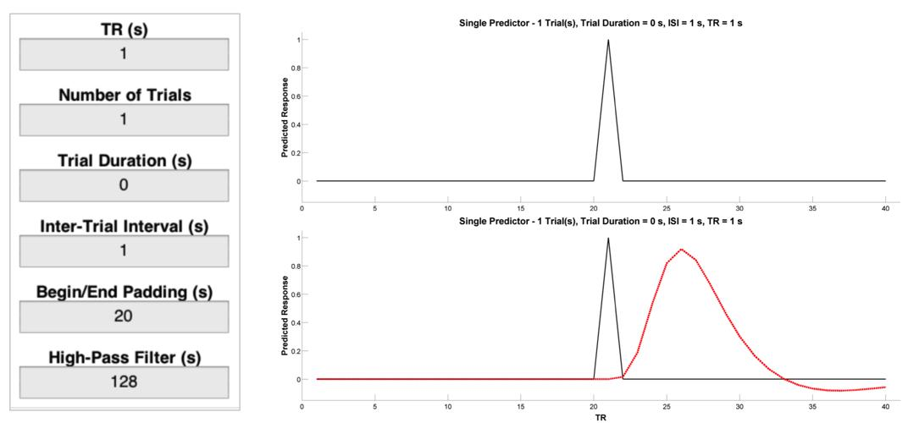
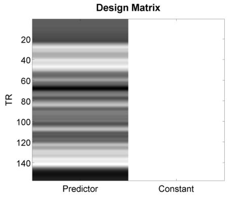
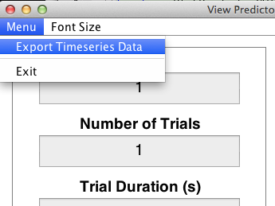



In this exercise, we will use the program `PlotPredictorGUI` to interactively specify and explore various timeseries predictors of the BOLD response. Much of this content is adapted from from Rik Henson's [excellent webpage on design efficiency](http://imaging.mrc-cbu.cam.ac.uk/imaging/DesignEfficiency).

## Basic Concepts

Before continuing, just a quick review of terminology . A **Condition** tonsists of a number of **Trials** .replications of that condition). A Trial consists of one or more elements. These elements can be **Events** which cause brief bursts of neural activity (e.g., an auditory cue presented for 500 ms) or **Epochs** which result in periods of sustained neural activity (e.g., a 40 s segment of a song). Events are assumed to have a zero duration, and in SPM, the duration value of "0" is treated as an Event. In contrast, Epochs always have a non-zero value, although this value is not necessarily fixed. The term **Variable Epoch Design** is used to describe conditions where epoch length is left to vary (e.g., as in tasks where task performance is partially self-paced). Finally, note the following terms commonly used to describe the spacing of Trials and their elements:

  1. **Intertrial Interval (ITI).** The time between successive trials of a given condition.
  2. **Interstimulus Interval (ISI).** The time between the offset (end) of one trial element and the onset (start) of the next.
  3. **Stimulus Onset Asyncrhony (SOA).** The time between onsets of successive trial elements.

## The PlotPredictorGUI

Start the program by entering its name at the MATLAB command line:

```matlab
    PlotPredictorGUI

```


This will open a window with the two panels above.

We'll call the panel on the left the **Input Panel**:

|----------------------|-----------------------------------------------------------------------------|
| TR (Repetition time) | Temporal resolution at which the image timeseries was acquired              |
| Number of Trials     | Number of trials in the timeseries                                          |
| Trial Duration       | Determines whether trials are events (duration=0) or epochs (duration&gt;0) |
| Intertrial Interval  | Duration of the interval between successive trials                          |
| Begin/End Padding    | Duration of the interval prior to the first trial and after the last trial  |
| High-Pass Filter     | Cutoff in secs for the high-pass filter (HPF) to apply to the timeseries    |

We'll call the panel on the right the **Plot Panel**:

|-----------------------------|-----------------------------------------------------------|
| Plot Raw                    | Plot the raw (unconvolved) timeseries.                    |
| Plot Convolved              | Adds the timeseries convolved with the the canonical HRF. |
| Plot Filtered               | Adds the timeseries filtered at the specified cutoff.     |
| Jitter Onsets               | Apply random jitter to the onsets                         |
| Plot Filtered Design Matrix | Show the plot as a design matrix                          |

## Predicting the BOLD Response to a Single Event/Epoch

Let's start with a single event, and consider how different parameters affect our ability to detect the BOLD response to that event as compared to a resting baseline condition. Enter the values listed below into the **Input Panel**. Then, press the **Plot Raw** button and you should see a plot like the one on the top right below. This is a representation of neural activity to a very brief event. Importantly, this is not a good representation of the BOLD response to a very brief event will look like. To get that, we need a basis function that is capable of translating neural activity to BOLD activity. To see the canonical (double-gamma) hemodynamic response function (HRF) - that is, the predicted change in BOLD activity in response to a nearly instantaneous burst of neural activity - press the **Plot Convolved** button and you should see a plot like the one on the bottom right below. This is the result of _convolving_ the timeseries of predicted neural activity with the canonical HRF. Note how sluggish the BOLD signal is relative to the neural event that caused it. It is slow to peak (5-6 s) and even slower to return to its "baseline" value of 0 (30-32 s).



Now let's look at the BOLD response to single epoch, which can either be thought of as a single event with a sustained duration (e.g., an emotional experienced), or as a series of events belonging to the same experimental condition (e.g., a 20-second block in which the participant is to solve 8 simple mental arithmetic problems). To see the epoch, change the _Trial Duration_ parameter in the **Input Panel** to 20. Plot both the raw and convolved regressors.


## Predicting the BOLD Response to Multiple Events/Epochs

We're ready to graduate to a single timeseries predictor for multiple events or epochs. Let's start with a design with 10 blocked trial epochs each lasting 20 seconds. Assuming you've been following along and haven't closed the plot, all you need to do is change the _Number of Trials_ parameter in the **Input Panel** to 10. Plot the raw and convolved timeseries. What is wrong with this picture?


Clearly, this arrangement of events looks pretty good at activating the brain. But, because there is very little spacing between successive epochs, the hemodynamic response never has a chance to return to baseline. Because of this, the variance of the signal across time is small. This brings us to the fundamental concept of **design efficiency** and how better to tell you about it than Rik Henson:

> "The basic idea behind maximising efficiency is to maximise the "energy" of the predicted fMRI timeseries. This is simply the sum of squared signal values at each scan. It is also proportional to the variance of the signal... In other words, to be best able to detect the signal in the presence of background noise (not shown), we want to maximise the variability of that signal. A signal that varies little will be difficult to detect."

With that in mind, let's return to our inefficient 10 block design. What should you change to increase the variance - and hence efficiency - of the design? Why did that work? What did you have to tradeoff in order to get this increase in efficiency?

Let's adapt our epoch design to make an event-related design. Event-related designs increase efficiency by allowing you to pack more events into a shorter period of time. Let's do an event-related design containing 40 trials (duration = 0). Since our trials are very brief, let's see if we can get away with an inter-trial interal of 3 seconds. Plot the raw and convolved timeseries.


Have we gained efficiency with this design? In the words of Rik Henson:

> "Because the  [hemodynamic responses] to successive events now overlap considerably, we end up an initial build-up (transient) followed by small oscillations around a "raised baseline". Although the overall signal is high, its variance is low, and the majority of stimulus energy will be lost after highpass filtering (particularly after removal of the mean, i.e lowest frequency)."

What's is the central problem with this design, and which button will help you fix it? Regardless of which button you have in mind, go ahead and press the **Jitter Onsets** button to re-create your event-related design with random jitter applied to the intervals between successive trials. Convolve the raw predictor with the canonical HRF.


Did this increase the variance of the signal? If you're not happy with the result, feel free to press the jitter button as many times as you'd like - each time, it'll randomly generate a new jittered timeseries. Before concluding this section, go ahead and press the **Plot Design Matrix** button. This will produce a new media/FIGure like the one below.



This is what people typically have in mind when they use the phrase "Design Matrix". The only way this differs numerically from the previous plot you created is its inclusion of a second column - the so-called constant or mean response - that is necessary for estimating a general linear model (GLM). In the next section, we'll consider issues that arise when multiple predictors are included (as is almost always the case), and will explore methods for quantifying the efficiency of a design matrix so that you can automate the discovery of the best (i.e., most efficient) design for your study.

## (Optional) Advanced Exercises

For these exercises, you'll see how SPM carries out timeseries convolution and high-pass filtering (HPF). To make this easier on you, you can export any timeseries predictor you create in the PlotPredictorGUI by clicking on **Export Timeseries Data** from the drop-down window on the top left of the GUI.



This will export your raw timeseries into a structure variable named "output" that you can play with through the MATLAB command window.

## Define the Impulse Response Function and Convolve with the Timeseries

The function SPM_HRF is use to create the IRF, while the function CONV allows you to convolve the timeseries with the IRF.

```matlab
ts      = output.X0;            % get the raw timeseries from 'output'
tr      = output.TR;            % do the same for the TR
irf     = spm_hrf(tr);          % create the impulse response function
cts     = conv(ts, irf);        % convolve the timeseries with the IRF
cts     = cts(1:length(ts));    % ensure that the long tail of the hemodynamic response hasn't lengthened our image timeseries
```

## Define the Filter Matrix and Apply it to the Convolved Timeseries

The function SPM_FILTER is used to both create the filter matrix "K" and and apply that filter matrix to our convolvecd timeseries "cts".

```matlab
    K.RT     = tr;                  % assign TR to K
    K.HParam = 128;                 % assign HPF cutoff (s) to K
    K.row    = 1:length(cts);       % the timepoints to filter (all, in this case)
    K        = spm_filter(K);       % add the filter matrix to the sturcture K
                                    % this matrix is stored in the field X0
    fcts     = spm_filter(K, cts);  % filter the timeseries using K
```